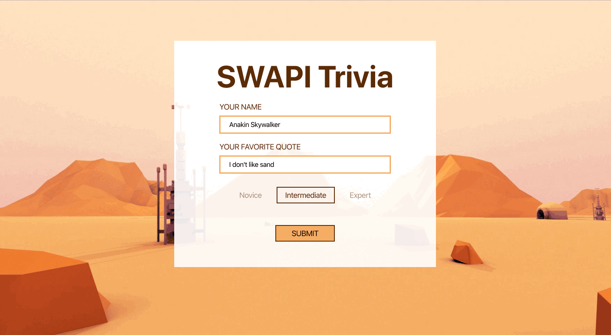
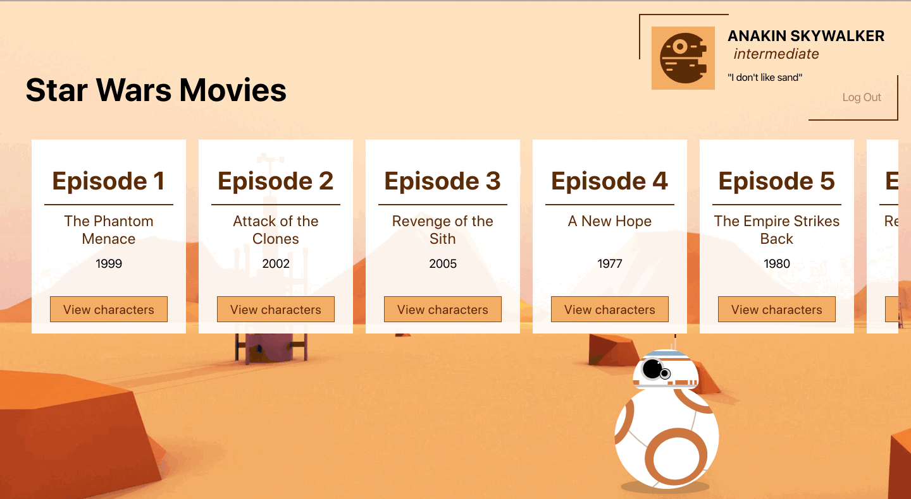
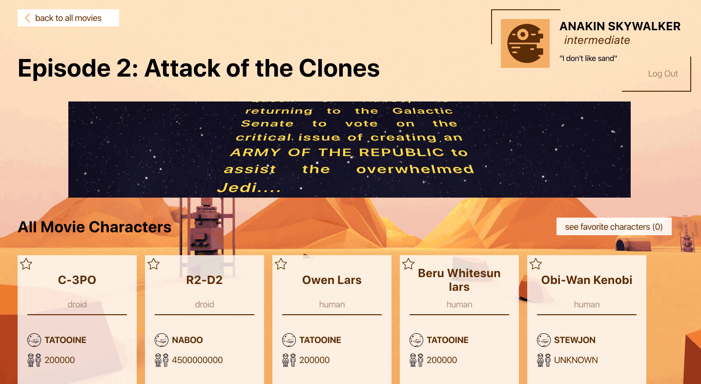
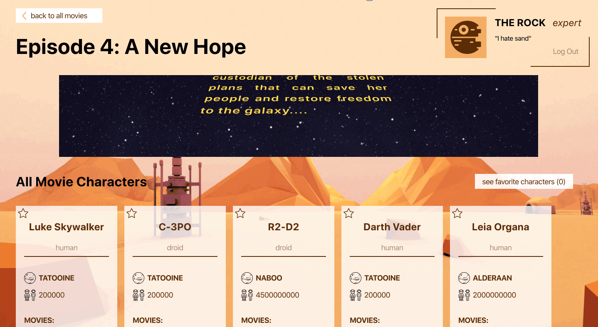
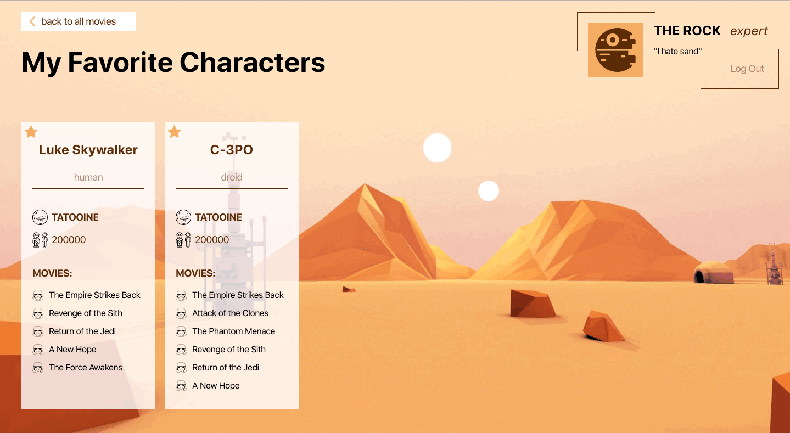

# SWAPI (Star Wars API)

This is application designed by was built with `create-react-app`.

## Group Members

Raisa Primerova and Allie McCarthy

### Set Up

Clone the repo. Run npm install to ensure all dependencies are running. Enjoy!

### Expectations / Spec

Build a React App that pulls Star Wars trivia from an API and displays it in multiple interative pages.  For this, we needed to learn how to access and control data from another server, and perform multiple nested fetches to do so.

Tasks:
- Create components and pass info between them.
- Create a form that takes in info added by a user and displays errors when the info is not present or incorrectly formatted
- Pull a list of Star Wars movies from the API and display them in order by episode.  Manipulate the fetched data to display the required information.
- Each movie card needs a button that fetches all characters from that movie, as well as nested data from each of those URL's
- User must be able to navigate back to the movies page from the characters page
- User must be allowed to favorite characters and see them in a new URL endpoint.

## Learning Goals

- Increase comfort level with building multiple components in React, passing data and methods using state and props
- Introduce the use of Router to navigate between different URL's, and allow the user to manually type in URL's if necessary.  Handle any routes that do not exist with a 404.
- Familiarize use of nested API's and Promise.all()
- Practice testing with Jest and Enzyme, and become familiar with async testing.

## Built With

- HTML5
- CSS3
- JavaScript
- React
- Router

## Demo
Logging in:

Movie page:

Character page:

Favorites page:

Logging out:

Page 404:

Note: All Star Wars images come from uihere.com

Much of the base CSS for BB-8 is credit to this Pen by Mike Dixon: https://codepen.io/mdixondesigns/pen/PPEJwz, which was the original inspiration for https://codepen.io/bullerb/pen/gMpxNZ by Brad Colthurst!

The R2D2 loading animation was taken from a Try Turing project

## License

All credit goes to Turing School of Software for providing the project specifications and website design.
